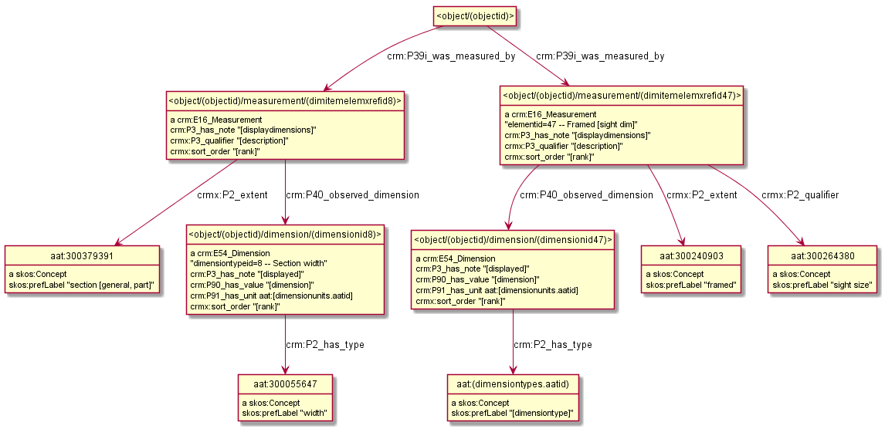

### Problem Statement

 How do we handle measurements of different parts of an object?

### Best Practice:

*To Be Determined*

### Discussion:

*(From David)*

How do we handle the strings that make up dimensions?

*(From Rob)*

We should try to parse them into their atomic statements and use the appropriate predicates.

*(From Vladimir)*

Not sure why you call them Linguistic.  E.g. see the following 2 diagrams showing how we model JPGM dimensions (they use TMS)

*(From David)*

I was referring to the display strings that concatinate them for human readability.  I agree that we should explicitly model dimensions.

### Reference:

* <https://github.com/american-art/npg/issues/54>
